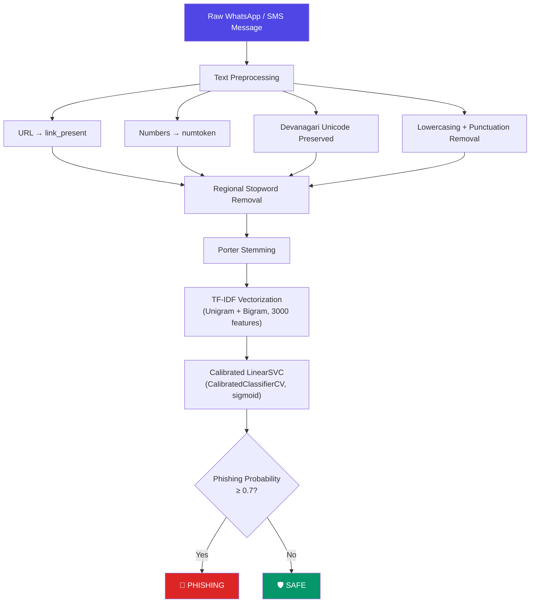

# Aavishkar
**Maharashtra State Inter-University Research Convention**

**Category:** 5 (Engineering and Technology) &nbsp;&nbsp;&nbsp;&nbsp;&nbsp;&nbsp;&nbsp;&nbsp;&nbsp;&nbsp;&nbsp;&nbsp;&nbsp;&nbsp;&nbsp;&nbsp;&nbsp;&nbsp;&nbsp;&nbsp;&nbsp;&nbsp;&nbsp;&nbsp;&nbsp;&nbsp;&nbsp;&nbsp; **Level:** PG  
**Code No.:** ____________

---
# Linguistic-Aware Phishing Detection Based on Indian Regional Languages Using Machine Learning

---

## Problem Statement

Over 800 million Indians use WhatsApp and SMS for banking, payments, and daily communication — often in Hindi, Marathi, Hinglish, Marathlish, and Devanagari script. Yet virtually all existing phishing/smishing detection systems are trained exclusively on English-language data. This leaves regional-language users systematically unprotected against KYC fraud, digital arrest scams, UPI fraud, lottery scams, and courier fraud — scam categories that specifically exploit local linguistic cues, urgency markers, and code-switched phrasing to bypass both human judgment and automated filters.

**Research Question:** Can a classical, interpretable, low-compute ML pipeline trained on a small curated multilingual dataset generalize to real, previously unseen scam messages — and serve as a practical baseline for regional-language phishing detection?

---

## System Pipeline



---

## Dataset Overview

| Property | Value |
|---|---|
| Total messages | 400 (balanced: 200 phishing, 200 legitimate) |
| Languages | English, Hindi, Marathi, Hinglish, Marathlish, Devanagari |
| Scam categories | KYC, Utility, Digital Arrest, Lottery, Banking, UPI, Loan, Courier, Job, Investment, Govt Scheme, Recharge |
| Train / Test split | 320 / 80 (stratified, random_state=42) |

---

## Model Benchmarking (5-Fold Stratified Cross-Validation)

| Model | CV Accuracy | CV F1 | CV ROC-AUC | CV PR-AUC |
|---|---:|---:|---:|---:|
| Logistic Regression | 0.9800 | 0.9804 | 0.9966 | 0.9965 |
| **LinearSVC** | **0.9775** | **0.9778** | **0.9978** | **0.9977** |
| Multinomial NB | 0.9575 | 0.9582 | 0.9909 | 0.9919 |

LinearSVC selected for highest ROC-AUC/PR-AUC and interpretable feature weights.

---

## Holdout Evaluation Results (80-message test set)

| Metric | Value |
|---|---:|
| **Accuracy** | **97.5%** |
| **Phishing Recall** | **100%** |
| Phishing Precision | 95.24% |
| Safe Recall | 95.0% |
| ROC-AUC | 0.9931 |
| PR-AUC | 0.9930 |
| Decision Threshold | 0.7 |

### Confusion Matrix

|  | Predicted Safe | Predicted Phishing |
|---|---:|---:|
| **Actual Safe** | 38 | 2 |
| **Actual Phishing** | **0** | 40 |

**Zero false negatives** — no phishing message was missed on the holdout set.

---

## Threshold Tuning Analysis

| Threshold | Accuracy | Precision | Recall | FN |
|---:|---:|---:|---:|---:|
| 0.3 | 92.5% | 87.0% | 100% | 0 |
| 0.5 | 96.3% | 93.0% | 100% | 0 |
| **0.7** | **97.5%** | **95.2%** | **100%** | **0** |
| 0.8 | 95.0% | 95.0% | 95.0% | 2 |
| 0.9 | 93.8% | 94.9% | 92.5% | 3 |

Threshold 0.7 maximizes accuracy while maintaining 100% phishing recall.

---

## Top Learned Features (LinearSVC Weights)

### Phishing Indicators

| Feature | Weight | Interpretation |
|---|---:|---|
| `link_pres` | +3.85 | Presence of URL is strongest phishing signal |
| `कर link_pres` | +1.09 | Devanagari "do" + link = phishing action phrase |
| `rs numtoken` | +0.80 | Amount mentions (Rs. + number) |
| `kyc` | +0.74 | KYC-related vocabulary |
| `pay` | +0.73 | Payment instruction |
| `account` | +0.71 | Account-related urgency |

### Legitimate Indicators

| Feature | Weight | Interpretation |
|---|---:|---|
| `aaj` | −1.04 | Casual everyday scheduling word |
| `kal` | −0.89 | Tomorrow — routine planning |
| `credit` | −0.76 | Normal banking vocabulary |

---

## NEW: Real-World Case Study Validation

**10 previously unseen messages** sourced from publicly reported Indian scam patterns — tested against the trained model without any retraining or tuning.

| # | Message (truncated) | Language | Category | True | Verdict | Confidence | Result |
|---|---|---|---|---|---|---|---|
| 1 | SBI ALERT: Your account will be blocked today… | English | KYC | Phishing | Phishing | 99.8% | ✅ |
| 2 | नमस्ते, मैं CBI से बोल रहा हूँ। आपके आधार कार्ड… | Hindi-Devanagari | Digital Arrest | Phishing | Safe | 35.6% | ❌ |
| 3 | Bhai tera UPI account block ho jayega kal… | Hinglish | UPI Fraud | Phishing | Phishing | 99.9% | ✅ |
| 4 | Tumcha parcel customs madhe atakla aahe… | Marathlish | Courier | Phishing | Phishing | 100.0% | ✅ |
| 5 | प्रिय ग्राहक, आपका बैंक खाता KYC निलंबित… | Hindi-Devanagari | KYC | Phishing | Phishing | 99.9% | ✅ |
| 6 | Congratulations! You have won Rs.25 Lakh… | English | Lottery | Phishing | Phishing | 100.0% | ✅ |
| 7 | Instant loan approved! Aapka Rs.5 lakh… | Hinglish | Loan | Phishing | Phishing | 99.8% | ✅ |
| 8 | India Post: Tumcha parcel customs duty… | Marathlish | Courier | Phishing | Phishing | 99.9% | ✅ |
| 9 | Your UPI payment of Rs.850 to BigBasket… | English | Legitimate | Safe | Phishing | 87.3% | ❌ |
| 10 | Aapka OTP hai 482916. Yeh kisi ke saath… | Hinglish | Legitimate | Safe | Safe | 10.4% | ✅ |

**Case Study Accuracy: 80% (8/10)**

### Error Analysis — Honest Assessment

**Message 2 (False Negative — Digital Arrest, Hindi-Devanagari):**
The digital arrest scam message contains no URLs or links. Since `link_present` is the model's strongest feature (weight +3.85), its absence causes the model to miss this threat. This identifies a specific limitation: **pure social-engineering text without embedded URLs requires additional feature engineering** (e.g., urgency-word dictionaries, authority-impersonation detection).

**Message 9 (False Positive — UPI Confirmation, English):**
The legitimate payment confirmation contains `Rs`, `numtoken`, and `sbi.co.in` (normalized to `link_present`) — all strong phishing indicators. The model correctly identifies threat-associated vocabulary but cannot distinguish transactional confirmations from solicitations. This is a **known conservative bias** that is acceptable in security applications (flagging a safe message is less harmful than missing a phishing message).

---

## Why This Matters

1. **Underserved population**: Regional-language users in India face phishing attacks designed to exploit linguistic familiarity — Hinglish "KYC update" scams, Marathlish "customs duty" frauds, Hindi "digital arrest" threats — with zero protection from English-only commercial filters.

2. **Practical and deployable**: The entire pipeline runs on a standard laptop with no GPU, no internet connection, and no API dependencies — making it viable for deployment in resource-constrained environments and offline mobile tools.

3. **Honest generalization evidence**: The real-world case study demonstrates that a classical TF-IDF + LinearSVC model trained on only 400 messages can detect 7/8 previously unseen phishing messages across 5 language formats, while also revealing specific failure modes (link-absent scams, transactional false positives) that guide future improvement.

---

## Live Demo

```
streamlit run demo_app.py
```

The demo accepts any raw WhatsApp/SMS message and shows:
- Verdict with confidence score
- Top contributing features for each message
- Full preprocessing trace (raw → cleaned → stemmed)
- Pre-loaded examples across languages and scam types

---

## Limitations and Future Work

| Limitation | Proposed Improvement |
|---|---|
| Small dataset (400 messages) | Expand to 5,000+ real crowdsourced samples |
| URL-dependent detection (link_present dominance) | Add urgency-word, authority-impersonation features |
| Porter Stemmer ineffective for Devanagari | Use IndicNLP/AI4Bharat preprocessing |
| No transformer comparison | Benchmark against MuRIL, XLM-R, mBERT |
| False positives on financial confirmations | Add context-aware message-type classification |
| No real-world deployment study | Build WhatsApp/SMS integration with user feedback |
